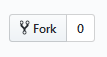

Dalla Fork alla Pull Request
================
-  [Accenno su GitHub](#Accenno-su-GitHub)
-  [Repository](#Repository)
-  [Fork](#Fork)
-  [Pull Request](#Pull-Request)

## Accenno su GitHub

GitHub è una piattaforma *hosting web* basata sul software open source di version controlGit, che permette lo sviluppo in collaborazione di progetti di qualunque tipo. Una volta aperto un account su GitHub, sarà possibile caricare progetti e lavori da condividere con gli altri utenti;cercare nelle repository di altri alla ricerca di un progetto interessante con il quale collaborare o dal quale prendere spunto; entrare in contatto con altre persone e condividere con loro progetti e idee

---
## Repository

Una *Repository* (abbreviata in repo) è il "luogo" dove viene caricato un progetto. Contiene tutti i file inerenti al progetto e tutte le versioni dello stesso. Nel caso di *repo* pubbliche le repo possono essere visibili a tutti, gli utenti possono accedervi e modificare il progetto. Per evitare che chiunque possa manomettere o scombinare i codici, i cambiamenti apportati al progetto devono essere valutati e concessi dall'autore della repo.

---
## Fork

una *Fork* è una copia di una repo e permette di compiere qualunque modifica senza agire sul progetto originale.Più comunemente, le *Fork* vengono utilizzate per proporre modifiche al progetto di qualcun altro o per utilizzare il progetto di qualcun altro come punto di partenza per la propria idea.

### Come creare una Fork

Per creare una *Fork* cliccare sul simbolo  in alto a destra della pagina della *repo* che si vuole copiare.A questo punto puoi compiere modifiche e cambiamenti sulla tua *Fork* senza modificare la repo originale. Puoi clonare la *Fork* sul tuo Pc per lavorare in remoto e sincronizzarla al progetto originale per trasferire le modifiche dalla *repository* originale al clone locale della *Fork*. Per ulteriori info vedere [GitHub Help](https://help.github.com/articles/fork-a-repo/).

---
## Pull Request

Una volta apportate le modifiche nella tua *Fork* potresti voler chiedere all'autore del progetto originale di inserire le tue modifiche nella *repo* originale. Questa richiesta prende il nome di *Pull Request*. Una volta aperta una *Pull Request*, è possibile discutere e rivedere le potenziali modifiche con i collaboratori prima che le modifiche vengano unite nella *Repository*.

### Come inviare una Pull Request

Se desideri che i cambiamenti apportati vengano inseriti nella repo originale puoi inviare una *PullRequest*. Cliccare l'icona della Pull Request  . Se le modifiche applicate non contrastano con il contenuto della *repo* originale apparira un'icona verde  . cliccando sul pulsante "create pull request" verrà chiesto di inserire un titolo e una descrizione della modifica effettuata (questo passaggio è opzionale). A questo punto le modifiche saranno visionate dal creatore della *repo* originale e potranno essere inserite attraverso il comando *Merge Pull Request* (solo il creatore della repository può salvare le modifiche nel proprio progetto )

